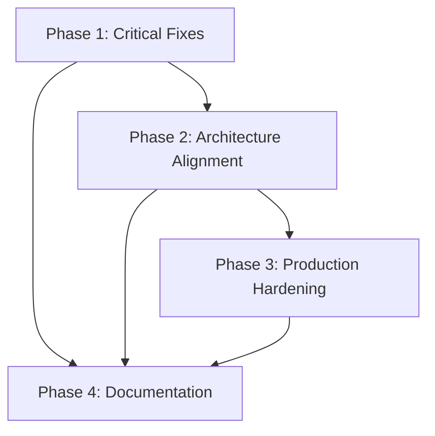

# Master Plan: Production Readiness
**Total Duration:** 5-7 weeks  
**Status:** Planning Phase

## Overview

This master plan coordinates four phases of work to bring the CMS to production-ready status. Each phase builds on the previous one, addressing critical issues first, then architectural improvements, then production hardening, and finally documentation.

## Phase Summary

### Phase 1: Critical Fixes (1-2 weeks)
**Priority:** Critical  
**Goal:** Remove hardcoded values, centralize configuration, standardize error handling, complete logging migration

**Key Deliverables:**
- Zero hardcoded tenant IDs
- Centralized configuration module
- Consistent error handling
- Complete logging migration

**See:** [PHASE_1_CRITICAL_FIXES.md](./PHASE_1_CRITICAL_FIXES.md)

### Phase 2: Architecture Alignment (2-3 weeks)
**Priority:** High  
**Goal:** Standardize database access patterns, add path aliases, split large files, align with controller pattern

**Key Deliverables:**
- All database modules use Sequelize ORM
- Path aliases implemented
- Large route files split
- Controller pattern adopted for new routes

**See:** [PHASE_2_ARCHITECTURE_ALIGNMENT.md](./PHASE_2_ARCHITECTURE_ALIGNMENT.md)

### Phase 3: Production Hardening (1-2 weeks)
**Priority:** High  
**Goal:** Add input validation, increase test coverage, add integration tests, set up error tracking

**Key Deliverables:**
- Input validation on all routes
- 60%+ test coverage
- Integration tests for critical flows
- Error tracking (Sentry) configured

**See:** [PHASE_3_PRODUCTION_HARDENING.md](./PHASE_3_PRODUCTION_HARDENING.md)

### Phase 4: Documentation (1 week)
**Priority:** Medium  
**Goal:** Update architecture docs, document auth strategy, create API docs, write deployment guide

**Key Deliverables:**
- Current architecture documented
- Authentication strategy guide
- Complete API documentation
- Deployment guides

**See:** [PHASE_4_DOCUMENTATION.md](./PHASE_4_DOCUMENTATION.md)

## Timeline

```
Week 1-2:  Phase 1 - Critical Fixes
Week 3-5:  Phase 2 - Architecture Alignment
Week 6-7:  Phase 3 - Production Hardening
Week 8:    Phase 4 - Documentation
```

## Dependencies



## Risk Assessment

### High Risk Items
1. **Hardcoded Tenant IDs** - Breaks multi-tenancy (Phase 1)
2. **Database Migration** - Could break existing functionality (Phase 2)
3. **Route Refactoring** - Could introduce bugs (Phase 2)

### Mitigation Strategies
1. Comprehensive testing after each change
2. Gradual migration (one module at a time)
3. Feature flags for new patterns
4. Rollback plan for each phase

## Success Metrics

### Phase 1
- [ ] Zero hardcoded tenant IDs
- [ ] All env vars in config module
- [ ] All routes use error handler
- [ ] All console statements migrated

### Phase 2
- [ ] 100% Sequelize ORM usage
- [ ] Path aliases working
- [ ] No route file > 500 lines
- [ ] New routes use controllers

### Phase 3
- [ ] 60%+ test coverage
- [ ] All routes validated
- [ ] Error tracking active
- [ ] Health checks comprehensive

### Phase 4
- [ ] Architecture docs complete
- [ ] API docs complete
- [ ] Deployment guides complete
- [ ] New developer can onboard

## Resource Requirements

### Development Time
- Phase 1: 7-11 days
- Phase 2: 13-18 days
- Phase 3: 10-14 days
- Phase 4: 6-7 days
- **Total: 36-50 days (5-7 weeks)**

### Dependencies to Install
- `zod` - Schema validation
- `@sentry/node` - Error tracking
- `swagger-ui-express` - API docs
- `swagger-jsdoc` - API docs
- `isomorphic-dompurify` - Input sanitization

## Getting Started

1. **Review all phase plans** - Understand the full scope
2. **Set up tracking** - Create issues/tasks for each phase
3. **Start with Phase 1** - Critical fixes first
4. **Test thoroughly** - After each phase
5. **Document as you go** - Update docs during implementation

## Progress Tracking

Use this checklist to track overall progress:

- [ ] Phase 1: Critical Fixes - Not Started
- [ ] Phase 2: Architecture Alignment - Not Started
- [ ] Phase 3: Production Hardening - Not Started
- [ ] Phase 4: Documentation - Not Started

## Questions or Issues?

If you encounter issues or need clarification:
1. Review the specific phase plan document
2. Check existing documentation
3. Review code examples in phase plans
4. Create an issue for discussion

## Next Steps

1. Review [Phase 1 Plan](./PHASE_1_CRITICAL_FIXES.md)
2. Set up project tracking (GitHub issues, Jira, etc.)
3. Begin Phase 1, Task 1: Remove Hardcoded Tenant IDs
