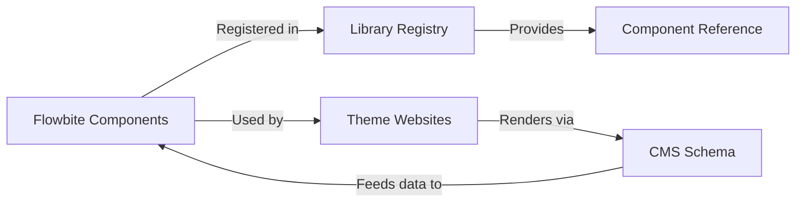

# Flowbite Design System

## 📋 Overview

This folder contains the **Flowbite** design system implementation - a comprehensive, production-ready component library that powers all theme websites in the CMS. Flowbite provides a consistent set of 29 components, styles, and patterns used across all tenant themes.

**Purpose**: Provide a single, unified design system that can be easily configured and used by `/theme` websites without duplicating code. By consolidating to Flowbite only, we ensure consistency, easier maintenance, and a clearer development path.

---

## 🏗️ Architecture

### Single Design System Structure

The architecture is now simplified with Flowbite as the sole design system:

```
src/libraries/
└── flowbite/                 # ✅ Flowbite Design System
    └── components/           # 29 CMS-integrated components
```

#### Flowbite Components (`src/libraries/flowbite/components/`)
- **Status**: Production-ready, fully implemented
- **Purpose**: CMS-integrated components that work with our schema system
- **Count**: 29 comprehensive components covering all use cases
- **Structure**: Components accept `ComponentSchema` from CMS

### Architecture Flow



---

## 🔄 Component Pattern

### Understanding Flowbite Components

All Flowbite components follow a consistent, CMS-integrated pattern that:

1. **Accept CMS Schema**: Components receive `ComponentSchema` instead of direct props
2. **Extract Data**: Use helper functions to extract data from schema items/props
3. **Render with Flowbite**: Use Flowbite's UI components (`flowbite-react`)
4. **Follow Standard Pattern**: All components follow the same structure for consistency

### Component Transformation Example

**Before (Standard React Component):**
```typescript
// Original component from setup folder
interface HeroProps {
  title: string;
  description: string;
  buttonText: string;
  buttonLink: string;
}

const Hero: React.FC<HeroProps> = ({ title, description, buttonText, buttonLink }) => {
  return (
    <section>
      <h1>{title}</h1>
      <p>{description}</p>
      <a href={buttonLink}>{buttonText}</a>
    </section>
  );
};
```

**After (Flowbite CMS-Integrated Component):**
```typescript
// Migrated component in active design system
import type { ComponentSchema } from "../../../../sparti-cms/types/schema";

interface FlowbiteHeroSectionProps {
  component: ComponentSchema;  // Accepts CMS schema
  className?: string;
}

const FlowbiteHeroSection: React.FC<FlowbiteHeroSectionProps> = ({
  component,
  className = "",
}) => {
  const props = component.props || {};
  const items = component.items || [];

  // Extract data from schema
  const getText = (key: string) => {
    const item = items.find(
      (i) => i.key?.toLowerCase() === key.toLowerCase() &&
      typeof (i as any).content === "string"
    ) as any;
    return item?.content || props[key] || "";
  };

  const title = getText("title");
  const description = getText("description");
  const buttonText = getText("buttonText");
  const buttonLink = getText("buttonLink");

  return (
    <FlowbiteSection className={className}>
      <h1>{title}</h1>
      <p>{description}</p>
      <Button href={buttonLink}>{buttonText}</Button>
    </FlowbiteSection>
  );
};
```

---

## 📐 Flowbite Component Standard

All Flowbite components follow this standard pattern for consistency and CMS integration.

### Required Structure

```typescript
"use client";

import React from "react";
import type { ComponentSchema } from "../../../../sparti-cms/types/schema";
import FlowbiteSection from "./FlowbiteSection";
import { Button, Card } from "flowbite-react";

interface FlowbiteComponentProps {
  component: ComponentSchema;  // Required: CMS schema
  className?: string;          // Optional: Additional styling
}

/**
 * Flowbite Component Name
 * 
 * Description of what this component does
 * 
 * @param component - Component schema from CMS
 * @param className - Additional CSS classes
 */
const FlowbiteComponent: React.FC<FlowbiteComponentProps> = ({
  component,
  className = "",
}) => {
  // 1. Extract schema data
  const props = component.props || {};
  const items = component.items || [];

  // 2. Helper functions for data extraction
  const getText = (key: string) => {
    const item = items.find(
      (i) => i.key?.toLowerCase() === key.toLowerCase() &&
      typeof (i as any).content === "string"
    ) as any;
    return item?.content || props[key] || "";
  };

  const getButton = (key: string) => {
    const item = items.find(
      (i) => (i.key?.toLowerCase() === key.toLowerCase() || key === "") &&
      i.type === "button"
    ) as any;
    return {
      content: item?.content || "",
      link: item?.link || "#",
    };
  };

  const getImage = (key: string = "image") => {
    const item = items.find(
      (i) => i.key?.toLowerCase() === key.toLowerCase() && i.type === "image"
    ) as any;
    return item?.src || props[key] || "";
  };

  // 3. Extract component data
  const title = getText("title");
  const description = getText("description");
  // ... more data extraction

  // 4. Render using Flowbite components
  return (
    <FlowbiteSection className={className}>
      {/* Component content using Flowbite UI */}
    </FlowbiteSection>
  );
};

export default FlowbiteComponent;
```

### Helper Functions Pattern

All components should use these standard helper functions for schema extraction:

- **`getText(key: string)`**: Extract text content from schema items or props
- **`getButton(key: string)`**: Extract button data (content, link, icon)
- **`getImage(key: string)`**: Extract image data (src, alt, title)
- **`getArray(key: string)`**: Extract array items from schema
- **`getHeading(key: string, level?: number)`**: Extract heading with optional level

### Base Section Component

Each design system should have a base `Section` component:

```typescript
export type DesignSystemSectionProps = {
  title?: string;
  subtitle?: string;
  containerClassName?: string;
  className?: string;
  id?: string;
  children?: React.ReactNode;
};

const DesignSystemSection: React.FC<DesignSystemSectionProps> = ({
  id,
  title,
  subtitle,
  containerClassName = "",
  className = "",
  children
}) => {
  return (
    <section id={id} className={`w-full ${className}`}>
      {(title || subtitle) && (
        <div className="flex flex-col gap-1">
          {title ? <h2>{title}</h2> : null}
          {subtitle ? <p>{subtitle}</p> : null}
        </div>
      )}
      <div className={containerClassName}>
        {children}
      </div>
    </section>
  );
};
```

---

## 🚀 Creating New Flowbite Components

This guide walks you through creating a new Flowbite component following the established pattern.

### Prerequisites

- ✅ Design system library available in `src/libraries/setups/`
- ✅ Understanding of the design system's structure and components
- ✅ Knowledge of React/TypeScript
- ✅ Access to design system documentation

### Step 1: Review Setup Folder Structure

Explore the setup folder to understand the design system's structure:

```bash
# Example: Review DaisyUI setup folder
src/libraries/setups/daisyui-master/daisyui-master/
├── packages/
│   ├── daisyui/          # Core DaisyUI package
│   │   ├── src/
│   │   │   ├── components/  # Component CSS files
│   │   │   ├── themes/      # Theme definitions
│   │   │   └── ...
│   └── docs/             # Documentation and examples
└── README.md
```

**Key things to identify:**
- Component structure and naming conventions
- Available UI components
- Theme system (if applicable)
- Styling approach (CSS classes, utilities, etc.)

### Step 2: Install Dependencies

Add the design system package to your project:

```bash
npm install daisyui
# or
npm install daisyui
```

Verify it appears in `package.json` dependencies.

### Step 3: Configure Tailwind

Edit `tailwind.config.ts`:

```typescript
import type { Config } from "tailwindcss";
import flowbitePlugin from "flowbite/plugin";
import daisyui from "daisyui";  // Add design system plugin

const config: Config = {
  content: [
    "./index.html",
    "./src/**/*.{ts,tsx}",
    "./sparti-cms/**/*.{ts,tsx}",
    "./node_modules/flowbite/**/*.js",
    "./node_modules/daisyui/**/*.{js,ts,jsx,tsx}",  // Add content paths
  ],
  // ... existing theme config ...
  plugins: [
    require("tailwindcss-animate"),
    flowbitePlugin,
    daisyui,  // Add design system plugin
  ],
  // Design system specific configuration
  daisyui: {
    themes: ["light", "dark", "cupcake"],
    base: true,
    styled: true,
    utils: true,
  },
};

export default config;
```

### Step 4: Create Design System Folder Structure

Create the folder structure for your active design system:

```bash
mkdir -p src/libraries/daisyui/components
mkdir -p src/styles/daisyui
```

### Step 5: Create Base Section Component

Create `src/libraries/daisyui/components/DaisyUISection.tsx` following the pattern from [Component Pattern](#component-pattern) section.

### Step 6: Migrate Components from Setup Folder

This is the core migration step. For each component you want to migrate:

1. **Identify the component** in the setup folder
2. **Understand its structure** and props
3. **Create migrated version** that:
   - Accepts `ComponentSchema` instead of direct props
   - Uses helper functions to extract data
   - Uses design system's UI components
   - Follows the standard component pattern

**Example Migration:**

From setup folder, you might find a hero component example. Adapt it:

```typescript
// src/libraries/daisyui/components/DaisyUIHeroSection.tsx
"use client";

import React from "react";
import type { ComponentSchema } from "../../../../sparti-cms/types/schema";
import DaisyUISection from "./DaisyUISection";

interface DaisyUIHeroSectionProps {
  component: ComponentSchema;
  className?: string;
}

const DaisyUIHeroSection: React.FC<DaisyUIHeroSectionProps> = ({
  component,
  className = "",
}) => {
  const props = component.props || {};
  const items = component.items || [];

  const getText = (key: string) => {
    const item = items.find(
      (i) => i.key?.toLowerCase() === key.toLowerCase() &&
      typeof (i as any).content === "string"
    ) as any;
    return item?.content || props[key] || "";
  };

  const getButton = (key: string) => {
    const item = items.find(
      (i) => (i.key?.toLowerCase() === key.toLowerCase() || key === "") &&
      i.type === "button"
    ) as any;
    return {
      content: item?.content || "",
      link: item?.link || "#",
    };
  };

  const title = getText("title") || getText("heading");
  const description = getText("description") || getText("subtitle");
  const cta = getButton("cta");

  return (
    <DaisyUISection className={className}>
      <div className="hero min-h-screen bg-base-200">
        <div className="hero-content text-center">
          <div className="max-w-md">
            <h1 className="mb-5 text-5xl font-bold">{title}</h1>
            <p className="mb-5">{description}</p>
            {cta.content && (
              <a href={cta.link} className="btn btn-primary">
                {cta.content}
              </a>
            )}
          </div>
        </div>
      </div>
    </DaisyUISection>
  );
};

export default DaisyUIHeroSection;
```

**Repeat this process** for each component you want to migrate (Hero, Header, Footer, Cards, etc.).

### Step 7: Create Theme Manager (if applicable)

If your design system supports themes, create a theme manager:

```typescript
// src/utils/daisyuiThemeManager.ts
type DaisyUITheme = 'light' | 'dark' | 'cupcake' | 'bumblebee' | 'emerald';

const STORAGE_KEY = 'daisyui-theme';

export function applyDaisyUITheme(theme: DaisyUITheme) {
  const html = document.documentElement;
  html.setAttribute('data-theme', theme);
  try {
    localStorage.setItem(STORAGE_KEY, theme);
  } catch {}
}

export function initDaisyUITheme(defaultTheme: DaisyUITheme = 'light') {
  let saved: DaisyUITheme | null = null;
  try {
    const s = localStorage.getItem(STORAGE_KEY) as DaisyUITheme | null;
    if (s) saved = s;
  } catch {}
  applyDaisyUITheme(saved || defaultTheme);
}

export function getAvailableDaisyUIThemes(): { id: DaisyUITheme; label: string }[] {
  return [
    { id: 'light', label: 'Light' },
    { id: 'dark', label: 'Dark' },
    { id: 'cupcake', label: 'Cupcake' },
    // ... more themes
  ];
}
```

### Step 8: Create Library Reference Page

Create a reference page component that showcases all migrated components:

```typescript
// src/components/visual-builder/DaisyUILibrary.tsx
import React from "react";
import DaisyUISection from "@/libraries/daisyui/components/DaisyUISection";
import type { ComponentSchema } from "../../../sparti-cms/types/schema";

const DaisyUILibrary: React.FC = () => {
  const components: Array<{
    id: string;
    name: string;
    description: string;
    sampleSchema: ComponentSchema;
  }> = [
    {
      id: "daisyui-hero",
      name: "Hero Section",
      description: "Full-width hero section with title, description, and CTA",
      sampleSchema: {
        type: "daisyui-hero",
        props: {},
        items: [
          { key: "title", content: "Welcome to Our Service" },
          { key: "description", content: "We provide amazing solutions." },
          { key: "cta", type: "button", content: "Get Started", link: "#" },
        ],
      },
    },
    // Add more components as you migrate them
  ];

  return (
    <div className="min-h-screen bg-gray-50">
      <div className="container mx-auto py-8">
        <div className="mb-8">
          <h1 className="text-4xl font-bold mb-2">DaisyUI Design System</h1>
          <p className="text-gray-600">Component library reference</p>
        </div>

        <div className="space-y-12">
          {components.map((component) => (
            <DaisyUISection key={component.id} title={component.name} id={component.id}>
              <div className="mb-4">
                <p className="text-sm text-gray-600">{component.description}</p>
              </div>
              <div className="rounded-lg border border-gray-200 bg-white p-4">
                {/* Component preview would go here */}
              </div>
            </DaisyUISection>
          ))}
        </div>
      </div>
    </div>
  );
};

export default DaisyUILibrary;
```

### Step 9: Register in Library Registry

Edit `src/config/libraryRegistry.ts`:

```typescript
import FlowbiteLibrary from "../components/visual-builder/FlowbiteLibrary";
import DaisyUILibrary from "../components/visual-builder/DaisyUILibrary";  // Add import

export const libraryRegistry: LibraryConfig[] = [
  {
    id: "flowbite",
    label: "Flowbite",
    available: true,
    component: FlowbiteLibrary,
  },
  {
    id: "daisyui",  // Add your design system
    label: "DaisyUI",
    available: true,
    component: DaisyUILibrary,
  },
];
```

### Step 10: Add Styles (if needed)

If your design system needs custom CSS, create theme files:

```css
/* src/styles/daisyui/default.css */
@import "daisyui/dist/full.css";

/* Custom overrides if needed */
```

### Step 11: Initialize in Main App (if needed)

If your design system needs initialization, update `src/main.tsx`:

```typescript
import { initDaisyUITheme } from '@/utils/daisyuiThemeManager';

// Initialize design system
initDaisyUITheme('light');
```

### Step 12: Test Integration

1. Create a test component using your migrated design system
2. Verify it renders correctly with sample schema data
3. Test in a theme to ensure integration works
4. Check that all helper functions extract data correctly

---

## 🔗 Integration Points

### Library Registry

Flowbite is registered in `src/config/libraryRegistry.ts`:

```typescript
export interface LibraryConfig {
  id: string;
  label: string;
  available: boolean;
  getMetadata: () => DesignSystemMetadata;
}

export const libraryRegistry: LibraryConfig[] = [
  {
    id: "flowbite",
    label: "Flowbite",
    available: true,
    getMetadata: getFlowbiteMetadata,
  },
];
```

### Component Key Mapper

Flowbite components are mapped to schema keys in `src/utils/componentKeyMapper.ts`:

```typescript
const LIBRARY_MAPPINGS: Record<string, Record<string, string>> = {
  flowbite: {
    header: "header",
    footer: "footer",
    hero: "hero",
    features: "features",
    // ... more mappings
  },
};
```

### Theme Integration

Themes in `sparti-cms/theme/{theme-name}/` import and use Flowbite components:

```typescript
// sparti-cms/theme/my-theme/index.tsx
import FlowbiteHeroSection from '@/libraries/flowbite/components/FlowbiteHeroSection';
import FlowbiteFeaturesSection from '@/libraries/flowbite/components/FlowbiteFeaturesSection';

// Use in theme component
<FlowbiteHeroSection component={heroSchema} />
<FlowbiteFeaturesSection component={featuresSchema} />
```

### Styling System

Flowbite styles are organized in `src/styles/flowbite/`:

```
src/styles/flowbite/
├── default.css      # Default Flowbite theme
├── minimal.css      # Minimal theme
├── enterprise.css   # Enterprise theme
├── playful.css      # Playful theme
└── mono.css         # Monochrome theme
```

Themes can override Flowbite styles in their `theme.css`:

```css
/* sparti-cms/theme/my-theme/theme.css */
/* Override Flowbite styles */
.btn-primary {
  @apply bg-purple-600 hover:bg-purple-700;
}
```

---

## ✅ Component Creation Checklist

When creating a new Flowbite component, ensure you:

- [ ] Review existing Flowbite components for pattern consistency
- [ ] Create component file in `src/libraries/flowbite/components/`
- [ ] Follow the standard ComponentSchema pattern
- [ ] Implement all required helper functions (getText, getButton, getImage, etc.)
- [ ] Use FlowbiteSection wrapper where appropriate
- [ ] Add component to FLOWBITE_COMPONENT_FILES in `designSystemProviders.ts`
- [ ] Test component with sample schema data
- [ ] Test integration in a theme
- [ ] Document component props and expected schema structure

---

## 📚 Flowbite Design System Reference

### Component Library

- **Location**: `src/libraries/flowbite/`
- **Components**: 29 production-ready components
- **Themes**: 5 themes (default, minimal, enterprise, playful, mono)
- **Documentation**: `docs/development/flowbite-component-creation-sop.md`

**Key Files:**
- Base component: `src/libraries/flowbite/components/FlowbiteSection.tsx`
- Example component: `src/libraries/flowbite/components/FlowbiteHeroSection.tsx`
- Theme manager: `src/utils/flowbiteThemeManager.ts`
- Library page: `src/components/visual-builder/FlowbiteLibrary.tsx`

### Available Components (29)

**Core Components:**
- FlowbiteHeroSection, FlowbiteFeaturesSection, FlowbiteCTASection
- FlowbiteFAQSection, FlowbiteTestimonialsSection, FlowbiteContentSection

**Blog Components:**
- FlowbiteBlogGrid, FlowbiteBlogHero, FlowbiteBlogSidebar

**Product/Service Components:**
- FlowbiteProductGrid, FlowbiteProductSection, FlowbiteServicesGrid, FlowbiteShowcase

**SEO/Marketing Components:**
- FlowbiteSEOResultsSection, FlowbiteWhatIsSEOSection, FlowbiteWhatsIncludedSection
- FlowbiteWhyChooseUsSection, FlowbitePainPointSection

**Social/Review Components:**
- FlowbiteReviews, FlowbiteSocialMedia

**Other Components:**
- FlowbiteNewsletter, FlowbitePageTitle, FlowbiteVideoSection, FlowbiteContent, FlowbiteSlider
- FlowbiteHeader, FlowbiteFooter, FlowbiteSection (base), FlowbiteAdminDashboardShell

---

## 🎨 Best Practices

### Component Structure Standards

1. **Consistency**: All components follow the same pattern
2. **Schema-Driven**: Accept `ComponentSchema` from CMS
3. **Type Safety**: Use TypeScript interfaces for all props
4. **Reusability**: Use FlowbiteSection wrapper for consistent layout
5. **Accessibility**: Follow Flowbite's accessibility guidelines
6. **Theming**: Support all 5 Flowbite themes (default, minimal, enterprise, playful, mono)

### Code Quality

1. **Helper Functions**: Use standard helper functions for data extraction
2. **Error Handling**: Handle missing data gracefully (empty strings, default values)
3. **Documentation**: Include JSDoc comments explaining component purpose
4. **Naming**: Follow naming convention: `{DesignSystem}{ComponentName}Section.tsx`

---

## 🐛 Troubleshooting

### Components Not Rendering

- **Schema structure**: Verify `ComponentSchema` structure matches component expectations
- **Data extraction**: Check helper functions are extracting data correctly
- **Console errors**: Check browser console for TypeScript or runtime errors
- **Flowbite installation**: Verify `flowbite` and `flowbite-react` are installed in `package.json`

### Styles Not Loading

- **Tailwind config**: Verify Flowbite plugin is added and content paths include Flowbite files
- **Theme loading**: Check that the correct theme CSS is being loaded
- **Theme conflicts**: Check for conflicting styles in theme CSS

### Theme Issues

- **Theme manager**: Verify `flowbiteThemeManager.ts` is working correctly
- **Theme files**: Ensure theme CSS files exist in `src/styles/flowbite/`
- **Theme switching**: Test theme switching functionality in the UI

### Component Structure Issues

- **Pattern compliance**: Compare with existing Flowbite components to ensure pattern is followed
- **Helper functions**: Verify helper functions match the standard pattern
- **Type errors**: Check TypeScript types match expected schema structure

---

## 📖 Additional Resources

- **Flowbite Documentation**: `docs/development/flowbite-component-creation-sop.md`
- **Flowbite Official Docs**: https://flowbite-react.com/
- **Theme System**: `sparti-cms/theme/README.md`
- **Library Registry**: `src/config/libraryRegistry.ts`
- **Component Key Mapper**: `src/utils/componentKeyMapper.ts`
- **Component Preview**: `/design-systems` route in app

---

## 🤝 Contributing

When creating a new Flowbite component:

1. Follow the standard component pattern (see Component Pattern section)
2. Reference existing Flowbite components for consistency
3. Test with sample schema data
4. Test integration in a theme
5. Add to FLOWBITE_COMPONENT_FILES list
6. Document component props and expected schema structure
7. Update this README if adding new categories of components

---

**Last Updated**: 2026-01-18  
**Design System**: Flowbite (consolidated from 7 systems to 1)  
**Maintained By**: Development Team
